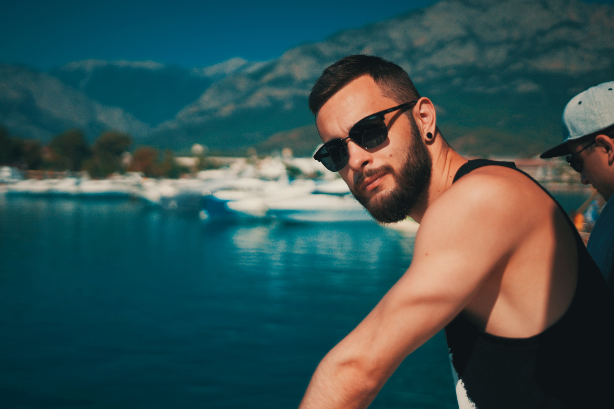

Привет. Меня зовут Артур, я дизайнер. С 2010 года помогаю малому бизнесу и благотворительным проектам создавать рекламную графику и удобные веб-приложения. Интересуюсь VR/AR-технологиями и машинным обучением. 

Сейчас работаю в «Инженерном центре Аквафор» и руковожу лейблом Astralique. Обучаю начинающих дизайнеров основам графического дизайна и проектирования интерфейсов. Консультирую онлайн.

Увлекаюсь астрофотографией, нейропсихологией и научной фантастикой. Веду телеграм канал о развитии критического мышления. В свободное время люблю кататься на сноуборде и играть в футбол.

Если у вас есть идеи и предложения, то я с радостью найду время обсудить их лично или онлайн. Вы всегда можете связаться со мной по ссылкам в шапке сайта. Некоммерческим организациям готов помочь бесплатно. Добро пожаловать.

### Графика
- Sketch, Figma
- Framer
- Photoshop
- Final Cut Pro

### Код
- HTML, CSS, JS
- Python

### 3D
- Vectary
- Cinema4D
